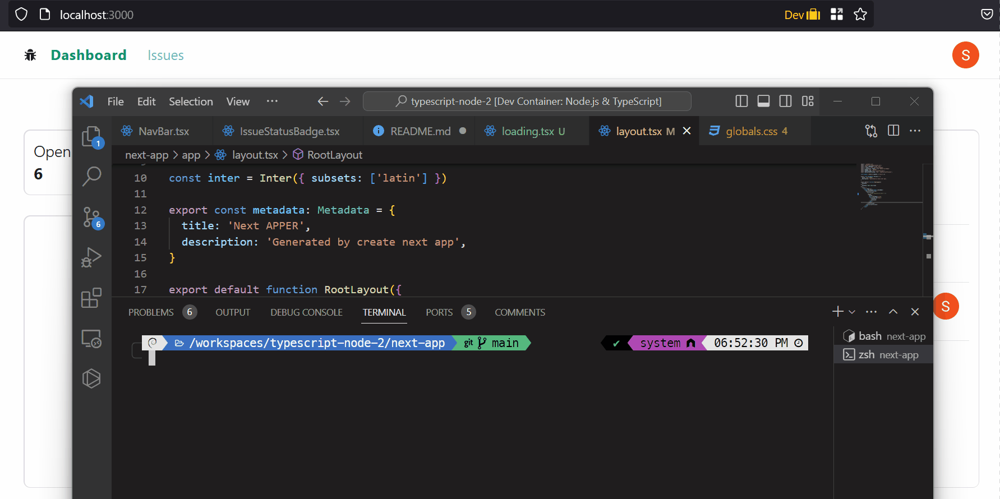

This is a [Next.js](https://nextjs.org/) project based on a tutorial. A simple issue management app using Google Auth, Radix UI, PostgreSQL (with Supabase), etc.

### Demo



## Getting Started

Clone repo on a docker container or vscode devcontainers.
```
"name": "Node.js & TypeScript",
"image": "mcr.microsoft.com/devcontainers/typescript-node:1-20-bullseye",
```
run the development server:

```bash
npm run dev
# or
yarn dev
# or
pnpm dev
```

Open [http://localhost:3000](http://localhost:3000) with your browser to see the result.

## Screenshots


